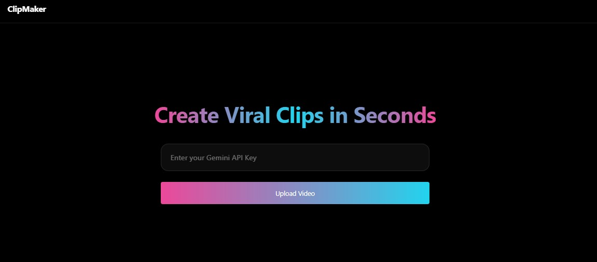

# ClipMaker 🎬✨

Este projeto foi desenvolvido durante a **:contentReference[oaicite:0]{index=0} (NLW-22)** da :contentReference[oaicite:1]{index=1}.

O **ClipMaker** é uma aplicação web que utiliza **Inteligência Artificial** para transformar vídeos longos em **clips curtos e virais automaticamente**, identificando os momentos mais relevantes com base na transcrição do conteúdo.

---

## 📸 Preview

---

## 🎯 Objetivo do Projeto

Construir uma aplicação moderna e funcional capaz de:

- Fazer upload de vídeos via Cloudinary
- Gerar automaticamente a transcrição do vídeo
- Utilizar IA (Gemini API) para identificar o momento mais viral
- Retornar um clip editado automaticamente (30s a 60s)
- Exibir o resultado final diretamente na interface

---

## 🛠️ Tecnologias Utilizadas

- **HTML5**
- **Tailwind CSS (CDN)**
- **JavaScript (Vanilla JS)**
- **Cloudinary (Upload + Processamento de vídeo)**
- **Gemini API (Google AI)**
- **GSAP (animações e microinterações)**
- **Lucide Icons**

---

## 🧠 O que eu aprendi

### ✔️ Integração com APIs e Serviços Externos
- Upload de arquivos com Cloudinary Widget
- Polling para aguardar processamento assíncrono (transcrição)
- Consumo da API do Gemini para análise de texto
- Tratamento de erros e retries em chamadas HTTP

---

### ✔️ Inteligência Artificial aplicada ao Front-End
- Uso de prompt engineering para extrair dados estruturados
- Transformação de texto em decisões automatizadas (corte de vídeo)
- Integração de IA em tempo real dentro de uma aplicação web

---

### ✔️ UX e Design de Interfaces Modernas
- Aplicação de **Glassmorphism**
- Uso de **gradientes inspirados no TikTok**
- Microinterações com `hover`, `scale` e animações suaves
- Feedback visual de status (loading, processamento, sucesso/erro)
- Hierarquia tipográfica e espaçamento com escala 8pt

---

### ✔️ Animações e Experiência do Usuário
- Animações de entrada com GSAP
- Controle de estados visuais (loading → processamento → resultado)
- Exibição condicional de elementos (vídeo só aparece quando pronto)

---

### ✔️ Estrutura e Organização
- Separação clara entre:
  - Configuração (`config`)
  - Estado da aplicação (`app`)
  - Elementos do DOM (`el`)
- Código modular e escalável mesmo em Vanilla JS

---

### 🔗 Links

- 💻 **Projeto Online**  
    https://estefpimenta.github.io/ClipMaker-nlw-operator/

